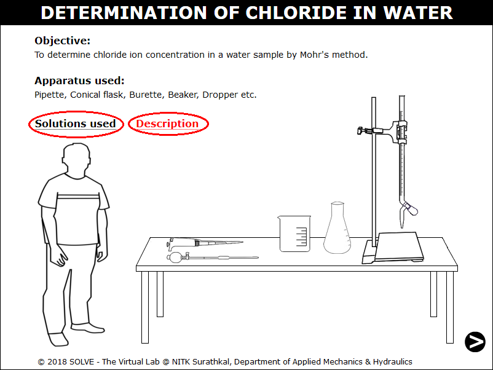
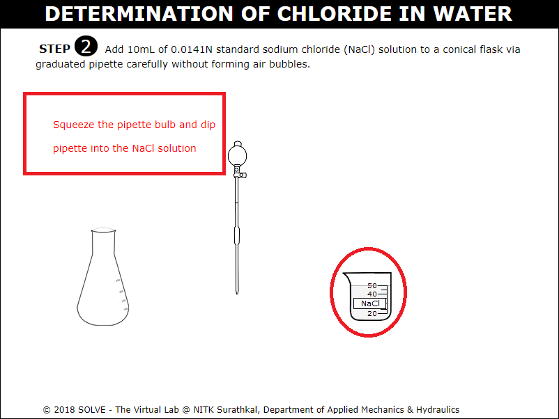
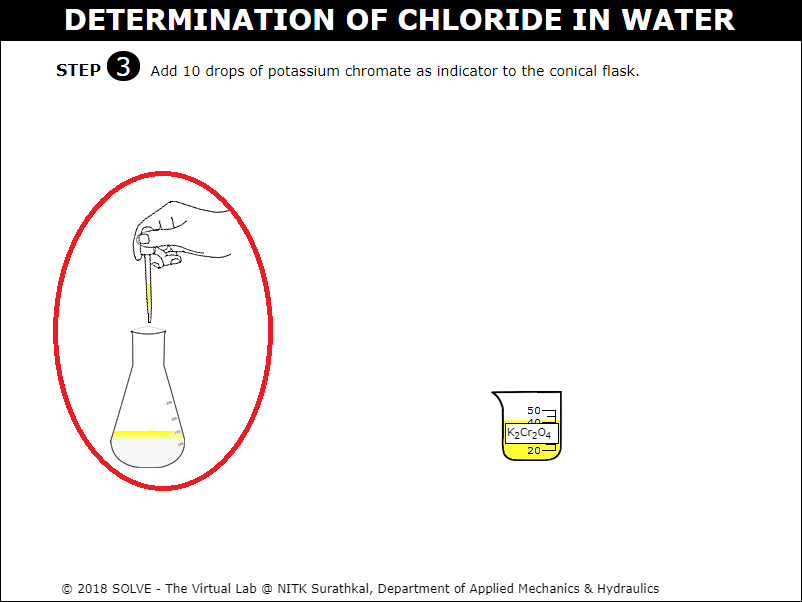
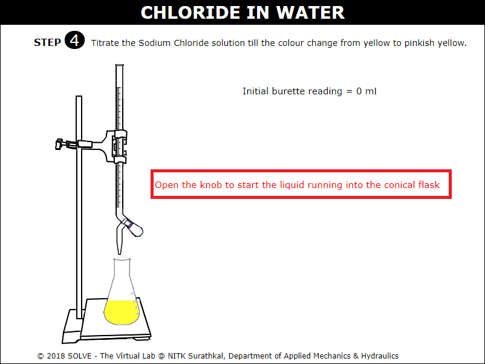
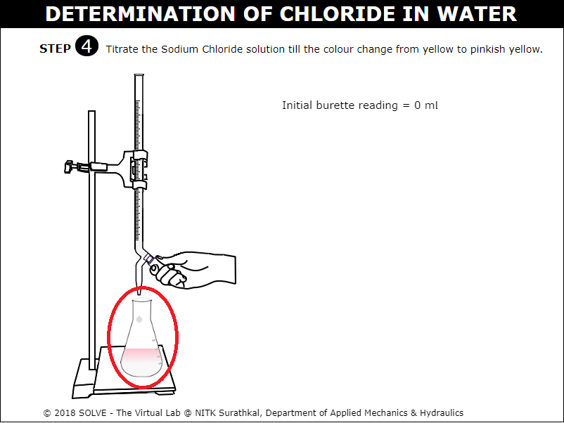
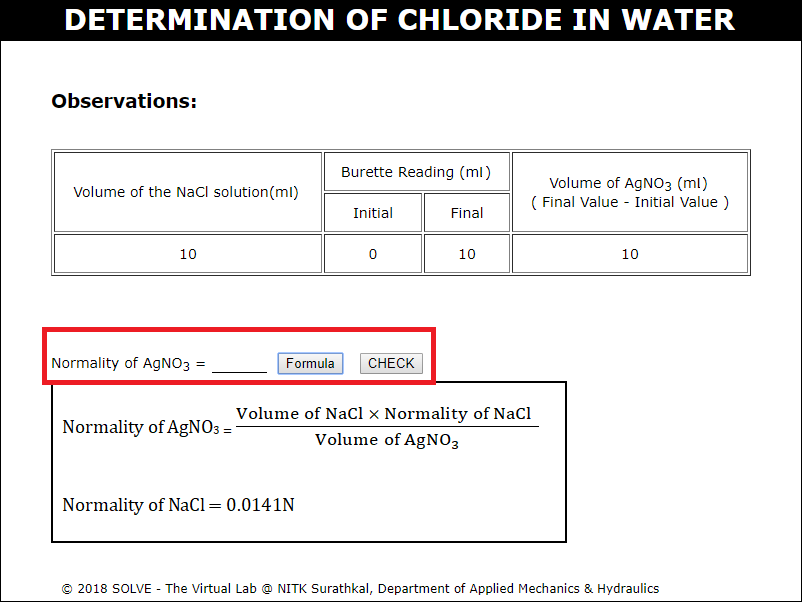
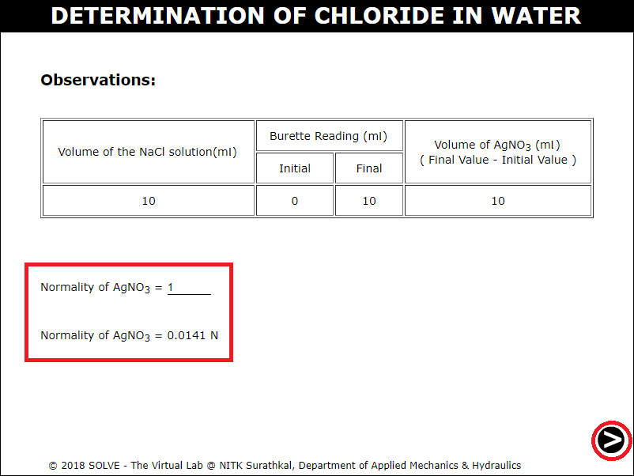
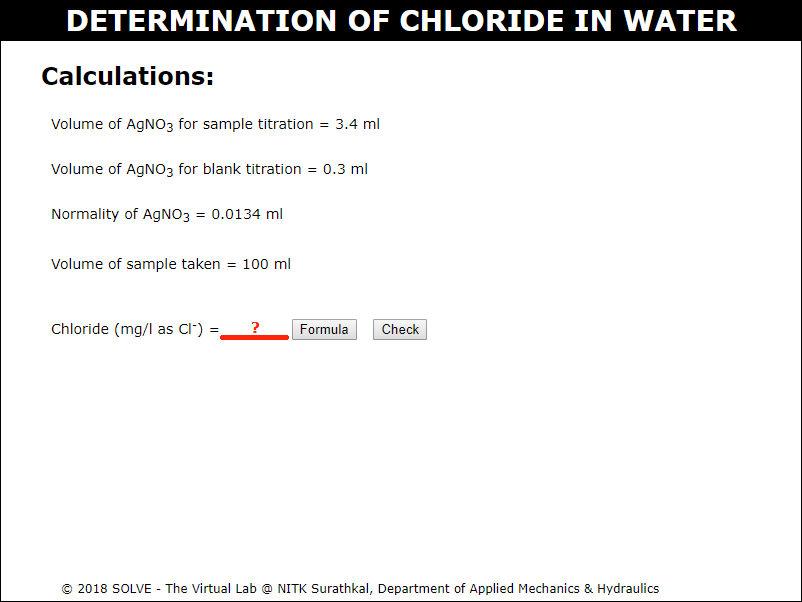

#### These procedure steps will be followed on the simulator

1. When you click on a Chloride in water file, a new window will open as shown below, go through the Description and Solutions used, then click on the next button at the bottom right corner to move to the next step. 
 

2. Click on funnel to place it in the burette and click again to silver nitrate (AgNO3) solution bottle to add it to the burette. 
 

3. Click on pipette to add 10ml of 0.0141N standard sodium chloride (NaCl) solution to a conical flask carefully without forming air bubbles. 
 

4. Click on the dropper to add 10 drops of potassium chromate as indicator to the conical flask. 
 

5. Click on the knob to start titrating sodium chloride solution till the colour change from yellow to pinkish yellow. 
 

6. Stop titration when the colour change is seen from yellow to pinkish red and note down the initial and final burette reading. 
 

7. Click on the formula text box and calculate the Normality of silver nitrate solution, then click on check to evaluate the result. 
 

8. Obtain the normality of silver nitrate solution and carry out the sample procedure of titration for blank test using distilled water sample and sample test using water sample. 
 

9. Display the calculation and obtain the value of chloride in water. 
 
